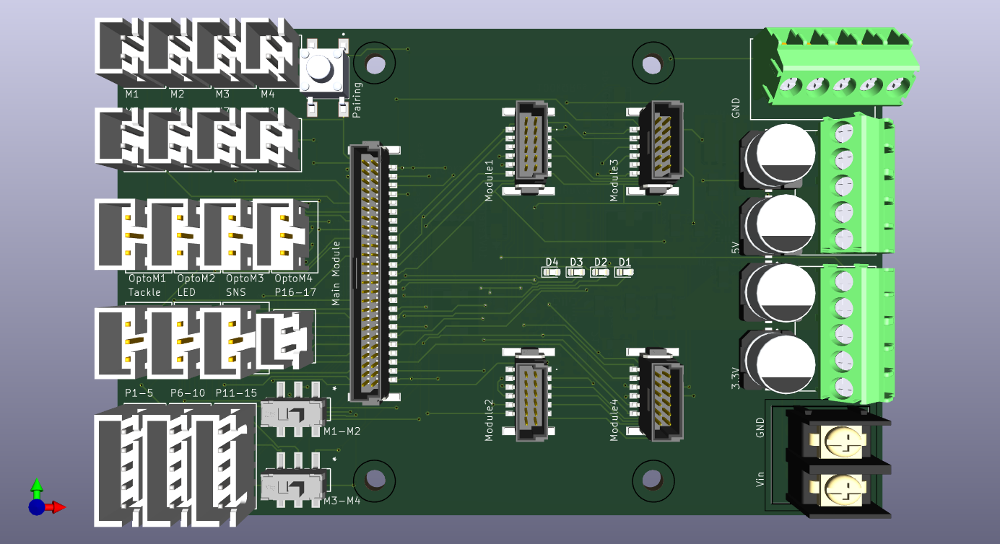
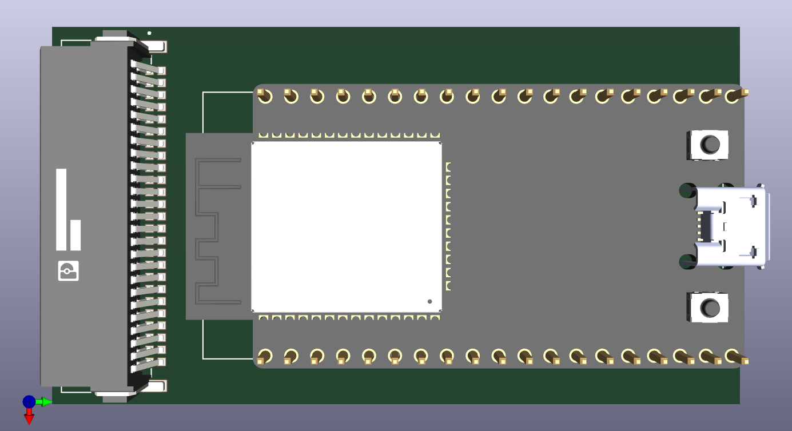

# MobileRobotPCB
## Description
This project introduces a printed circuit board (PCB) designed for use in mobile robots, integrating voltage regulation, opto-isolation, and multiple protection circuits to ensure safe and effective operation. The board includes several protective features to mitigate the effects of vibration and circuit misuse, safeguarding the microcontroller from damage. A buck-boost converter allows for a wide range of input voltages, while opto-isolation prevents current feedback from high-power components. Additional circuits provide overvoltage, overcurrent, and reverse polarity protection. The modular PCB design supports various microcontrollers and features secure JST connectors, making it well-suited for research applications and robotics competitions.

## Images

